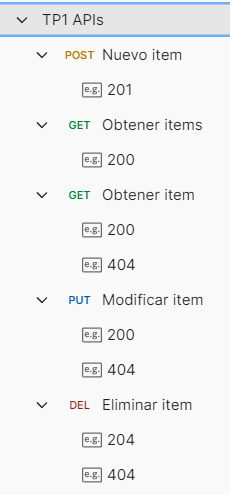

# TP1 - Fundamentos de APIs (Django)

Este repositorio corresponde al **Trabajo Practico 1** de Fundamentos de APIs.  
Se desarrollo una API REST simple con Django para gestionar una lista de items en memoria y practicar operaciones CRUD basicas.


## Que se implemento

- Estructura base del proyecto Django (`TP1`) y app `api`.
- Ruteo principal en `TP1/urls.py` con prefijo `/api/`.
- Endpoints para coleccion y recurso individual en `api/urls.py`.
- Logica en `api/views.py` para:
  - `GET /api/items/`: listar items.
  - `POST /api/items/`: agregar item.
  - `GET /api/items/<id>/`: obtener item por id.
  - `PUT /api/items/<id>/`: modificar item.
  - `DELETE /api/items/<id>/`: eliminar item.
- Manejo basico de errores:
  - JSON invalido (`400`).
  - Item no encontrado (`404`).

## Ejecucion local

```bash
pip install django
python manage.py runserver
```

Servidor local: `http://127.0.0.1:8000/`

## Pruebas en postman




